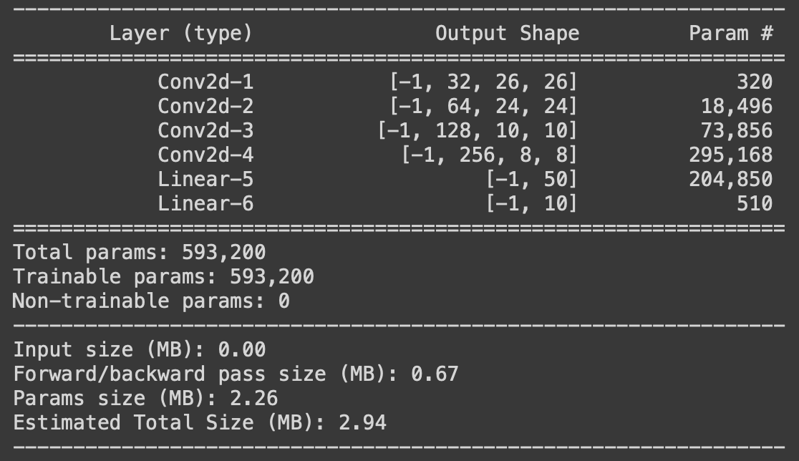

#  Image Classifier

This is a Machine learning model to predict the digit between 0-9 from the image containing a hendwritten digit init. Model is a Deep Learning Convolutional Neural Network.

***

## Usage
Following are the 3 files present in the repository that are required to train the model and test it's performance.

### model.py
This is the file where the model structure is defined. it's a Convolution Neural Network model which has some convolutional layer followed by linear layers to predict the output class based on input image.
Exact structure of the model is defined below.

| Layer     | Input     | Output    | Kernel Size |
|-----------|-----------|-----------|-------------|
| conv1     | 1x28x28   | 32x26x26  | 3x3         |
| conv2     | 32x26x26  | 64x24x24  | 3x3         |
| maxpool2d | 64x24x24  | 64x12x12  | 2x2         |
 | conv3     | 64x12x12  | 128x10x10 | 3x3         |
| conv4     | 128x10x10 | 256x8x8   | 3x3         |
| maxpool2d | 256x8x8   | 256x4x4   | 2x2         |
| FC1       | 256x4x4   | 50        | NA          |
| FC2       | 50        | 10        | NA          |

#### Summary
Below is the summary of the model.

***

### utils.py
In this file some important and reusable functions are defined that can be imported and used inside the project while training or testing.
Currently the functions that are defined inside utils.py are:
1. train(model, device, train_loader, optimizer, criterion)
2. test(model, device, test_loader, criterion)
3. GetCorrectPredCount(pPrediction, pLabels) | Returns no. of correct predictions.

***

### S5.ipynb
This is the notebook where dataset, dataset transformation and dataloaders are defined.
There are also the blocks of code present to visualise and understand the input images.
Finally model from model.py and functions from utils.py are imported in the notebook to train the model and test it's accuracy.
 
